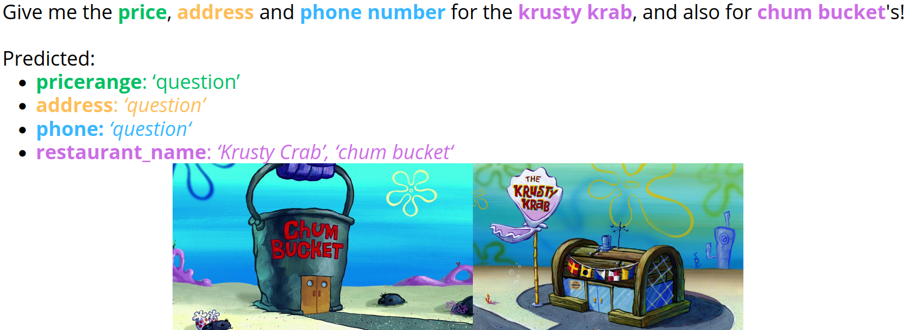

# Conversational-Agent-NER

A NER system for the Semantic frame slot filling task of a Conversational Agent for hotels and restaurants, trained and evaluated on the MultiWOZ dataset. 
It consists of:
- A NER system based on a Deberta-v3-base model, trained using the flair NLP library.
    - Detects directly mentioned slots (restaurant food types, restaurant and hotel names...)
    - Detects `question` and `dontcare` direct mentions
- A K-NN classifier that is fed scaled sentence embeddings of user utterances using bge-large-en-v1.5, used to classify `question` and `dontcare` user utterances that indirectly refer to previously mentioned slots.

This system was developed during the Natural Language Interaction course from Intelligent Interactive Systems @ Universitat Pompeu Fabra, alongside  and 

Note: This repo only contains the NER model's training notebook, and is intended to be run on a GPU host. The full Conversational Agent is available at: TBD

The slides showing the complete system are also uploaded on `slides.pdf`
